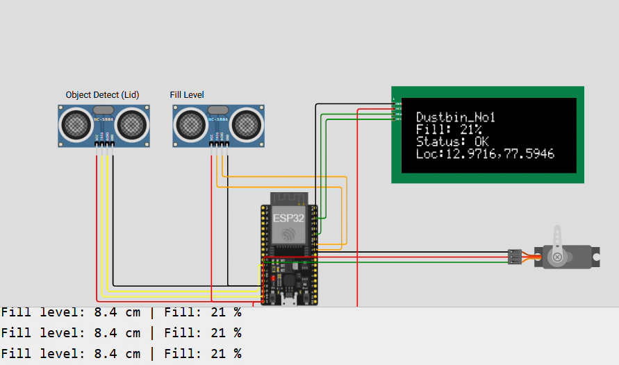
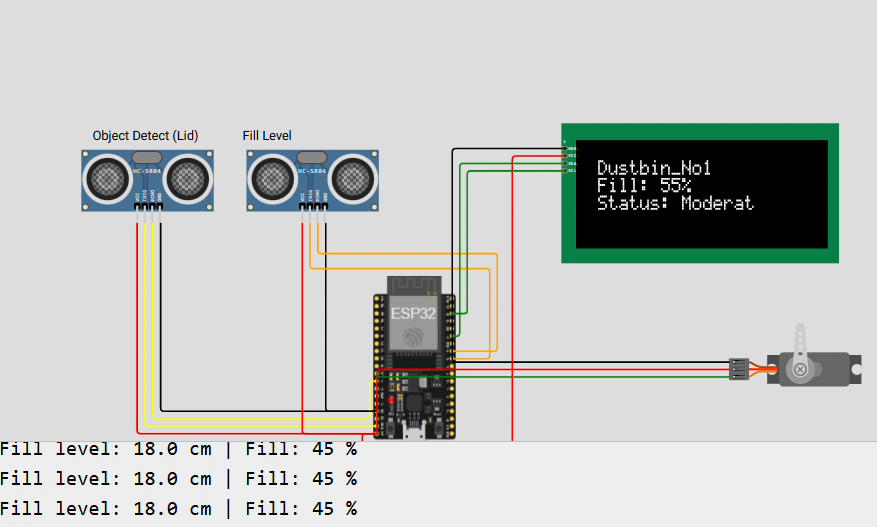
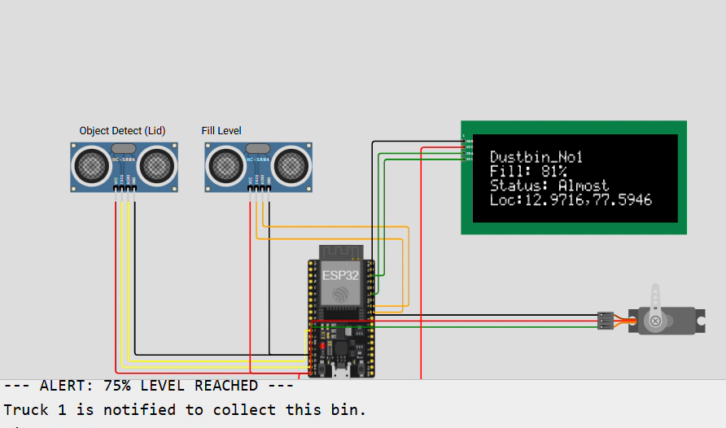

# 🗑️ IoT-Based Smart Waste Management System

## 📌 Overview
The **IoT-Based Smart Waste Management System** is designed to monitor the fill level of garbage bins in real time using an ESP32 microcontroller and ultrasonic sensors. The system displays the bin status on an LCD screen, updates the fill percentage, and sends alerts when the garbage level reaches predefined thresholds. This helps prevent overflow, enables timely waste collection, and supports efficient smart city waste management.

---

## ✨ Features
- 📊 Real-time garbage fill level monitoring
- 📏 Ultrasonic sensor-based waste detection
- 📍 Dustbin location display
- 📱 Blynk IoT cloud integration
- 🚛 Automatic alert at 75% fill level
- 🚨 Critical alert at 95% fill level
- 📺 LCD display for live status updates
- 🔄 Automatic reset after simulated garbage collection

---

## 🛠️ Hardware Components
- ESP32 Development Board
- HC-SR04 Ultrasonic Sensors (2)
- 16×2 I2C LCD Display
- Servo Motor
- Jumper Wires
- Breadboard
- USB Power Supply

---

## 💻 Software & Technologies
- Arduino IDE
- Wokwi Simulator
- Blynk IoT Platform
- Embedded C/C++
- GitHub

---

## 📂 Project Files
- 📄 Mini_Project_REPORT.pdf
- 📊 Project_Presentation.pptx
- 💻 SmartWasteManagementSystem.ino

---

## 📷 Project Outputs

### 🟢 1. System Initialization
Shows the dustbin at a low fill level with normal operating status.

---

### 🟡 2. Moderate Fill Level
Displays the garbage bin at a moderate fill level.

---

### 🟠 3. 75% Fill Level Alert
The system sends a notification to Truck 1 when the bin reaches 75% capacity.

---

### 🔴 4. 95% Critical Alert
A critical alert is generated and all available garbage collectors are notified.

---

## ⚙️ Working Principle

1. ESP32 continuously reads the ultrasonic sensor values.
2. The fill percentage of the dustbin is calculated.
3. Current status is displayed on the LCD.
4. Data is sent to the Blynk IoT dashboard.
5. At **75%**, the first garbage truck is notified.
6. At **95%**, a critical alert is sent to all available garbage collectors.
7. After garbage collection, the system resets and starts monitoring again.

---

## 🚀 Future Enhancements
- 📱 Android/iOS Mobile Application
- ☁️ Cloud Database Integration
- 🤖 AI-Based Waste Collection Prediction
- ☀️ Solar Powered Smart Dustbins
- 🌍 Multiple Dustbin Monitoring Dashboard

---

## 👥 Team Members
- Isra Zainab
- Madeeha
- **Saniya Naz**
- Shirin

---

## 🎓 Institution
**Yenepoya Institute of Technology**

---

## 📜 License
This project is developed for academic and educational purposes.

---

⭐ **Thank you for visiting this repository!**
If you found this project useful, consider giving it a ⭐ on GitHub.
